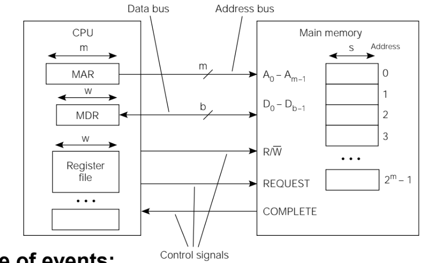

# CPU to memory interface

Sequence of events that happen in the working of a CPU to Memory interface. [their interaction]

1. Read

    * CPU loads (MAR) *Memory Address Register*, issues a read and the request is completed.
    * Main memory transmits words to MDR
    * Main memory asserts COMPLETE.

2. Write

    * CPU loads MAR and MDR, asserts write and request was sent
    * Value in MDR is written to address in MAR
    * Main memory asserts COMPLETE.
