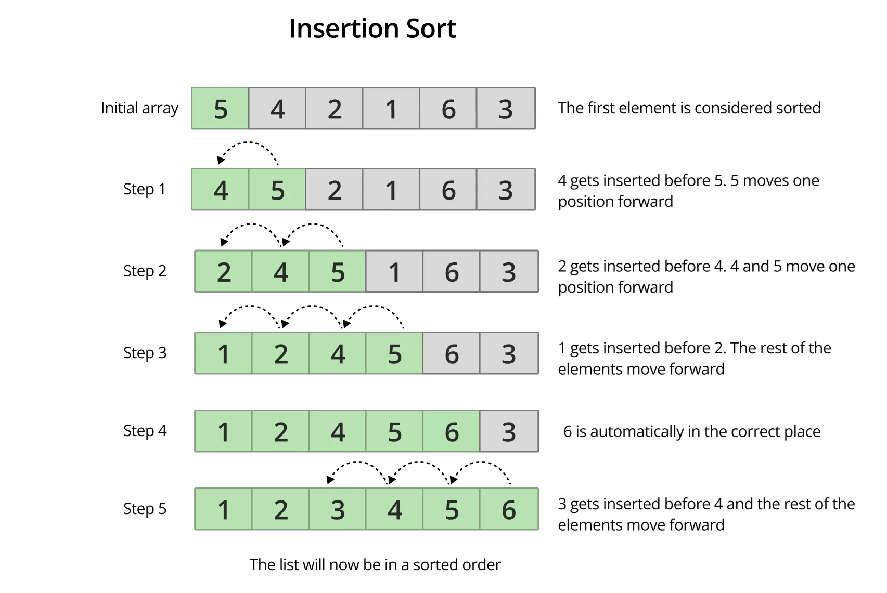
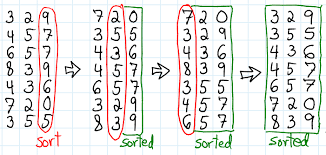

# Insertion-sort

## How insertion-sort works

* Divide into sorted and unsorted array -> Array is conceptually divided into sorted subarray and unsorted subarray. Initially, the first subarray is considered sorted as a single element array is sorted by default
* Iterate through the unsorted element -> The algorithm iterates through the unsorted elements (subarray)
* In each iteration, an element from the unsorted part is picked the ***key***
* The key is then compared with elements in the sorted part, *moving from right to left*
  * If an element in the sorted part is greater than the key, it is shifted one space to the right to make space for the key
  * This shifting continues until an element smaller than or equal to the key is encountered.
* Insert the key -> Once the correct position is found, insert the key
* Repeat the above steps for elements in the unsorted part.




```c
// C program for implementation of Insertion Sort
#include <stdio.h>
/* Function to sort array using insertion sort */
void insertionSort(int arr[], int n)
{
    for (int i = 1; i < n; ++i) {
        int key = arr[i];
        int j = i - 1;
        /* Move elements of arr[0..i-1], that are
           greater than key, to one position ahead
           of their current position */
        while (j >= 0 && arr[j] > key) {
            arr[j + 1] = arr[j];
            j = j - 1;
        }
        arr[j + 1] = key;
    }
}
/* A utility function to print array of size n */
void printArray(int arr[], int n)
{
    for (int i = 0; i < n; ++i)
        printf("%d ", arr[i]);
    printf("\n");
}
// Driver method
int main()
{
    int arr[] = { 12, 11, 13, 5, 6 };
    int n = sizeof(arr) / sizeof(arr[0]);
    insertionSort(arr, n);
    printArray(arr, n);
    return 0;
}
/* a code by Hritik Shah. */
```

## Radix-sort

Radix sort is a non-comparative integer sorting algorithm that sorts data with integer keys by grouping keys by individual digits which share the same significant position and value. It is particularly efficient for sorting large numbers or strings with fixed-size keys. 

How radix-sort works...



## Address-calculation-sort

Address Calculation Sort (also called Hashing Sort or Distribution Sort) is
a non-comparison sorting method that uses a hash function to map input elements to specific "buckets" (often linked lists) in an auxiliary array, then sorts within those buckets and concatenates them for a final sorted list, making it very efficient for uniformly distributed, non-contiguous data like account numbers. 

### How Address 📢 calculation sort works

* Hash function -> A specific hash function like f(x) = floor( (x/max_value) * size ) is applied to each key to determine its *bucket index*. This hash function must be order preserving.
* Each element is placed into its corresponding bucket.
* Any sorting method *like insertion sort* sorts the elements within each individual bucket
* The sorted buckets are then linked together in order to produce the sorted array.
