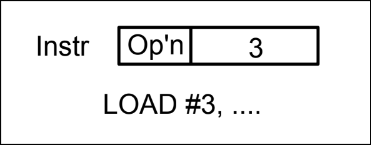
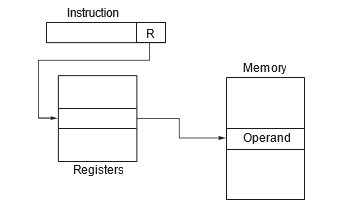
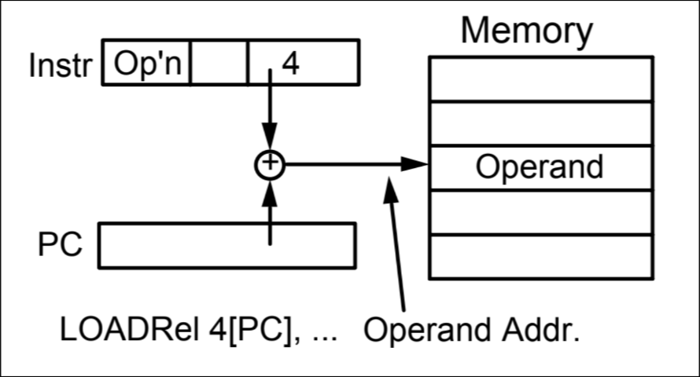

# Different addressing modes with RTN 🧑‍⚖

#### Immediate addressing

Instruction contains the operand.

#### Direct addressing

Instruction contains address of operand.

#### Indirect addressing

Instruction contains address of address of operand.

#### Register indirect-addressing

Register contains address of operand

#### Displacement based (index) addressing
Here, address of operand = register + constant

#### Relative addressing
Address of operand is equal to program counter (PC) + some constant

