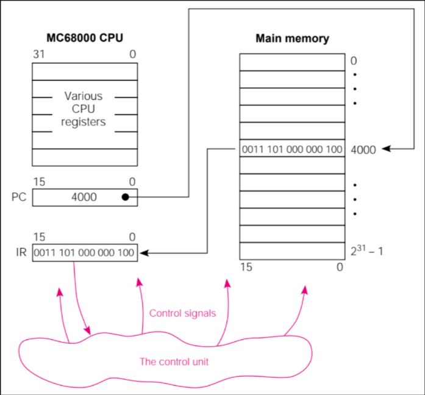

# The fetch execute cycle 🚵

The fetch execute cycle is a fundamental process of a computer's CPU.
The CPU uses this *fetch-execute-cycle* to run programs by repeatedly
fetching an instruction from memory, decoding it and executing it.

There are 3 main stages
  * Fetch -> CPU gets next instruction from memory as directed by the
  Program Counter (PC).
  * Decode -> The CPU interprets the instruction to understand what
  action needs to be performed. It identifies any required data for the
  operation
  * Execute -> CPU performs action as specified by the instruction
