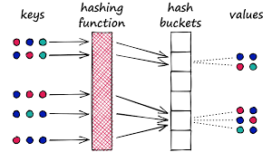

# Hashing
It is the process of converting data of any size into a "fixed-size unique string of characters" called a "hash"

It is a mathematical algorithm that converts an input (key), like a file or string of characters or something like a password into a fixed-size string of characters, called a *hash-value*

Think of a hash-function like this...
You pass in a string like...(say) a name like "opa-ralte", then the hash-function returns a number (say) 71 and (maybe) that 71 is the address of something or the index of an element in an array (or some other thing). Whenever you pass that string "opa-ralte" into the hash-function, you always get the number 71.

# Hash-table (organization)
This is quite similar to the example I gave on the string "opa-ralte" and the fact that it always maps to the number 71 when we insert it into the hash function...
So, hash-table (organization) uses a hash-function to map keys to specific array indices -> extremely fast data insertion/deletion/retrieval <-, this is achieved by using (once-again) a hash-function which calculates where the data lives.

#### things to know about hash-table (organization)
  * key-value pairs -> data is stored in unique keys and their associated value(s).
  * hash-function -> an algorithm that converts a key into an integer a **hash-code** which determines the array index.
  * array(buckets) -> an underlying storage, an array where each element holds data.
  * hashing -> the overall process. (**its the name of the process**)

# Collision
Collision happens inadvertently when (let's say) "rema-ralte" accidentally maps to 71 also. This can be rectified by using techniques such as separate-chaining and open-addressing.

# Static-hashing
In Static-hashing, the data bucket size doesn't change. That means we are using a fixed-size hash-table.
A hash-function always maps a key to the same (permanent) bucket address.

# Dynamic-hashing
***aka*** Extendible-hashing
It allows hash tables to grow or shrink dynamically along with the size of data.

