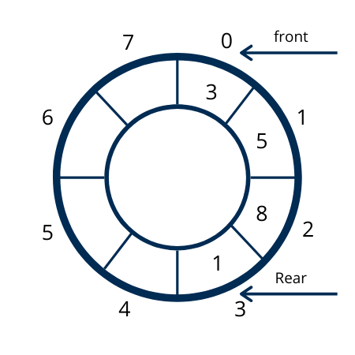

# 🐈‍⬛ Queues 🐩
Queues are abstract data types that are linear in nature. They follow a first in first out
policy. It has two ends, front(head) and rear(tail). And it can perform two basic insertion/
deletion operation, namely *enqueue* and *dequeue* 

# 😁 Queue implementation in c using arrays
``` c
#define MAX 5
int queues[MAX];
int front = -1; // a chhuah-na lam
int rear = -1; // a luh-na lam
// enqueue
void enqueue(int value) {
  if (front == 0 && rear == MAX-1) {
    printf("Queue overflowed, cannot enqueue %d\n", value);
    return;
  } else {
    if (front <= rear) {
      queues[++rear] = value;
    } else {
      front = -1;
      rear = -1;
    }
    return;
  }
}
// dequeue
void dequeue() {
  if (front == -1 && rear == -1) {
    printf("Queue underflow. No element to dequeue\n");
    return;
  } else {
    if (front <= rear) {
      printf("Dequeued %d\n", queues[front+1]);
      front++;
    } else {
      front = -1;
      rear = -1;
    }
  }
  return;
}
```

# 🎪 Circular queue
A circular queue is linear data structure that is basically a queue.
But it's rear is connected to its front.

  * Why do we need it?
We need a circular queue because it solves a memory-waste problem, found
in normal queues
  * Circular queues allow element insertion and deletion to wrap around the
  array's boundaries.




# 🙃 Deques - Double ended queues 👻
A deque **aka** double-ended queue is a *flexible* data structure that allows
insertion and deletion from both ends.
Usually, it is implemented using circular-array and linked-list(double ended)


# 🙋 Priority queue 🤭
A priority queue is a queue in which each element has an associated priority
which determines its order of service. The priority queue serves highest priority
items first.
