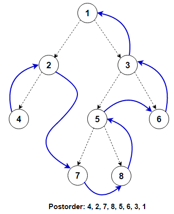
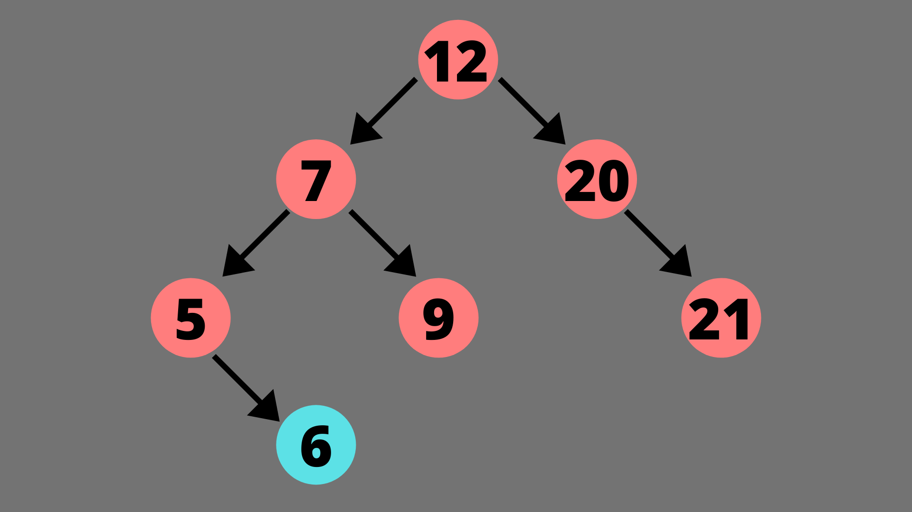

# 🪾 Trees, data structures

A tree as a data structure is basically is a way of structuring data in the form
that resembles a tree.


# 🍉 terminology 🍉

  1. Node -> A fundamental element in a tree that holds data and links to other nodes
  2. Root -> Topmost node in a tree
  3. Edge -> A link or connection to other nodes *it represent a parent-child relationship*
  4. Parent -> A node that has one or more child nodes
  5. Child -> A node that is connected to a parent node and moving away from the Root
  6. Siblings -> Nodes that share the same parent
  7. Leaf-node(External-node) -> A node that has no children
  8. Internal-node -> A node that has at least one child
  9. Ancestor -> Any node at the path from the root to the node itself without the node itself
  10. Descendent -> A node that is reachable from any node by moving from parent to child
  11. Subtree -> A portion of a tree that is itself a tree
  12. Level -> Distance of a node from a root (root is at level 0)
  13. Height -> Max level of any node in a tree
  14. Degree of a node -> The number of children a node has 
  15. Degree of a tree -> The maximum degree among all nodes of a tree 
  16. Path -> A sequence of edges connecting two nodes
  17. Forest -> A collection of disjoint trees


# ♀️ Binary 🪾 Trees ♂️

A binary tree is basically a tree where each node has two children maximum

#### properties
Core properties
  1. Max two children -> Each node has zero/one/two children (left and right)
  2. A single starting root
  3. Each node has only 1 parent


# 🫠 Array representation of a binary-tree 🫠
  * root node is at index 0
  * for any node stored at index *i*
    * it's left child is at index 2 * *i* + 1
    * it's right child is at index 2 * *i* + 2
  * the parent of a node at index *i* can be found using (*i* - 1) // 2


# 🔗 Linked representation of a binary-tree 🔗

A linked representation of a binary-tree uses nodes connected by pointers.

A node definition in C language looks something like this...
```c
struct Node {
  int data;
  struct Node* left;
  sturct Node* right;
};
```


# 🚃 Binary tree traversals


### 🚅 Inorder 
```c
// inorder traversal
void inorder(struct Node* root) {

  if (root == NULL) {

    return;
  }

  inorder(root->left);

  printf("%d ", root->data);

  inorder(root->right);
}
```


### 🚇 Preorder 
```c
// preorder traversal
void preorder(struct Node* root) {
  if (root == NULL)
    return;

  // visit the root
  printf("%d ", root->data);

  // traverse the left subtree
  preorder(root->left);

  // traverse the right subtree
  preorder(root->right);
}
```


### 🚤 Postorder 
```c
// postorder traversal
void postorder(struct Node* root) {
  if (root == NULL)
    return;

  // traverse the left subtree
  postorder(root->left);

  // traverse the right subtree
  postorder(root->right);

  //visit the root
  printf("%d ", root->data);
}
```



# 🌓 Binary search tree 🌗
A binary search tree is a specific type of binary tree where
  * left child's data is always less than root's data
  * right child's data is always greater than root's data




# 😡 Additional binary tree operations 😡

### 🔪 Deletion 🔪
```c
int getRightMin(struct Node* root) {
  struct Node* temp = root;
  // min value must be present in the left most node
  while (temp->left != NULL) {temp = temp->left;}
  return temp->data;
}

struct Node* removeNode(struct Node* root, int data) {
  // if the root is NULL, it will return NULL
  if (root == NULL) {
    return NULL;
  }
  // if the root's data is less than the input data
  // input data must be present in the right subtree
  if (root->data < data) {
    root->right = removeNode(root->right, data);
  } else if (root->data > data) {
    root->left = removeNode(root->left, data);
  } else {
    // both left and right reference is null
    if (root->left == NULL && root->right == NULL) {
      free(root);
      return NULL;
    }
    // node has a right child
    if (root->left == NULL) {
      struct Node* temp = root->right;
      free(root);
      return temp;
    // node has a left child
    } else if (root->right == NULL) {
      struct Node* temp = root->left;
      free(root);
      return temp;
    } else {
      int rightMin = getRightMin(root->right);
      root->data = rightMin;
      root->right = removeNode(root->right, rightMin);
    }
  }
  return root;
}
```

### 😚 Insertion 😚
```c
// insert function
struct Node* insert(struct Node* root, int data) {
  // if the root is empty, return new node in the root
  if (root == NULL) {
    return createNode(data);
  }

  // if the root's data is less than the input data
  if (root->data < data) {
    root->right = insert(root->right, data);
  }

  // if the root's data is greater than the input data
  else if (root->data > data) {
    root->left = insert(root->left, data);
  }

  return root;
}
```


### 🧵 Threaded binary trees 🧵

